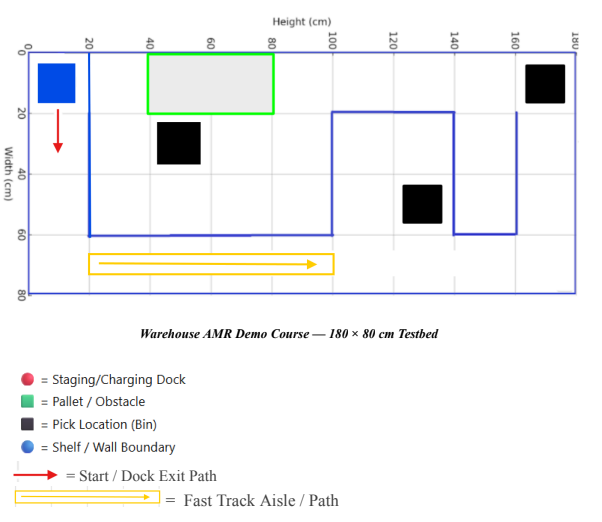

# cs556-final-project

## Overview



## Testing Simulation
``` bash
cd /test/
g++ test_visitedStates.cpp -o test_visitedStates
./test_visitedStates
```

## Project Phases
- Phase 1: Navigation and Localization – The robot navigates and localizes throughout the entire known layout.
- Phase 2: Return to Staging/Charging Dock – Once all three bins have been collected, the robot will return to the staging and charging dock.
- Phase 3: Pick Detection & Service – The robot identifies and services three pick locations.
- Phase 4: Speed management and safety considerations – speed may vary (static or dynamic). Operate conservatively to protect the robot and the course.

## Project Hard Deadline Schedule
- Step A1 and A2: Due Nov 25
- Step B1 and B2: Due Dec 2
- Step C (Demo Day): Due Dec 9
- Step D: Due Dec 11
